<div align="center">

# 🩺 Clinical Copilot

### Production-Ready AI Clinical Assistant powered by RAG, LangGraph, Voice AI, Real-Time Streaming, and Modern MLOps

*An end-to-end demonstration of production AI engineering — from a single FastAPI endpoint to a fully observable, streaming, containerized clinical assistant.*

[](https://www.python.org/)
[](https://fastapi.tiangolo.com/)
[](https://www.postgresql.org/)
[](https://www.docker.com/)
[](https://github.com/features/actions)
[](LICENSE)
[](https://github.com/manozpdel/Clinical-Copilot/commits/main)
[](https://github.com/manozpdel/Clinical-Copilot/stargazers)
[](https://github.com/manozpdel/Clinical-Copilot/issues)
[Live Demo](#) *(coming soon)* · [Documentation](docs/) · [Report Bug](https://github.com/manozpdel/Clinical-Copilot/issues) · [Request Feature](https://github.com/manozpdel/Clinical-Copilot/issues)

</div>

---

## 📚 Table of Contents

- [Project Overview](#-project-overview)
- [Screenshots](#-screenshots)
- [Features](#-features)
- [Tech Stack](#-tech-stack)
- [System Architecture](#-system-architecture)
- [Project Structure](#-project-structure)
- [Installation](#-installation)
- [Environment Variables](#-environment-variables)
- [Running the Project](#-running-the-project)
- [API Documentation](#-api-documentation)
- [AI Pipeline](#-ai-pipeline)
- [Authentication Flow](#-authentication-flow)
- [Database Schema](#-database-schema)
- [RAG Pipeline](#-rag-pipeline)
- [LangGraph Workflow](#-langgraph-workflow)
- [Voice Pipeline](#-voice-pipeline)
- [Streaming](#-streaming)
- [Observability](#-observability)
- [Human Feedback System](#-human-feedback-system)
- [Experiment Framework](#-experiment-framework)
- [Background Jobs](#-background-jobs)
- [CI/CD](#-cicd)
- [Testing](#-testing)
- [Performance](#-performance)
- [Security](#-security)
- [Deployment](#-deployment)
- [Roadmap](#-roadmap)
- [Contributing](#-contributing)
- [FAQ](#-faq)
- [License](#-license)
- [Acknowledgements](#-acknowledgements)
- [Contact](#-contact)

---

## 🎯 Project Overview

### The Problem

Clinicians and care teams spend a disproportionate amount of time hunting through disconnected records — EHR fields, physician notes, wearable data — to answer simple questions like *"What medications is this patient currently taking?"* Most AI chatbot demos stop at a single retrieval-augmented answer and never address the things that actually matter in a real deployment: **who is asking**, **can they be trusted with this data**, **is the answer grounded in evidence**, **what does it cost**, **how do we know when it's wrong**, and **can it scale**.

### The Solution

**Clinical Copilot** is a reference implementation of a production-grade agentic AI application, built incrementally across 13 engineering milestones (numbered through 15 to include infrastructure). It answers clinical questions by reasoning over synthetic patient records using a LangGraph agent that can route between semantic retrieval and structured clinical tools (EHR, notes, wearables), grounds every answer in citations, evaluates its own faithfulness, and exposes the entire pipeline through authenticated REST, SSE, and WebSocket APIs — all wrapped in the observability, security, and deployment tooling a real product would need.

> ⚠️ **Disclaimer:** Clinical Copilot operates entirely on **synthetic, fictional patient data** generated for demonstration purposes. It is an engineering showcase, not a certified medical device, and must not be used for real clinical decision-making.

### Key Capabilities

- 🧠 **Agentic reasoning** — LangGraph routes each question through planning, tool selection, retrieval, generation, and self-evaluation
- 🔍 **Grounded answers** — every response cites the exact patient record, chunk, and source file it came from
- 🎙️ **Multimodal input** — ask by text or by voice (Groq Whisper transcription)
- ⚡ **Real-time streaming** — watch the agent think, retrieve, and generate token-by-token over SSE or WebSocket
- 🔐 **Real auth** — JWT + Google OAuth, rate limiting, and per-user quotas
- 📊 **Full observability** — structured logs, OpenTelemetry traces, Prometheus metrics, optional LangSmith tracing
- 👍 **Human feedback loop** — likes, 5-star ratings, comments, hallucination reporting, and admin analytics
- 🐳 **Deploy anywhere** — Docker Compose (dev & prod), Nginx, Celery/Redis background jobs, GitHub Actions CI/CD

---

## 📸 Screenshots

<div align="center">

| Login | Chat |
|:---:|:---:|
| 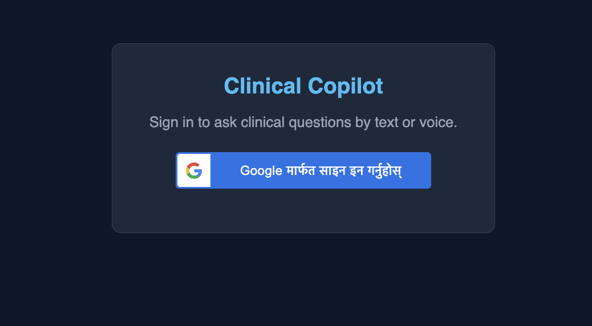 | 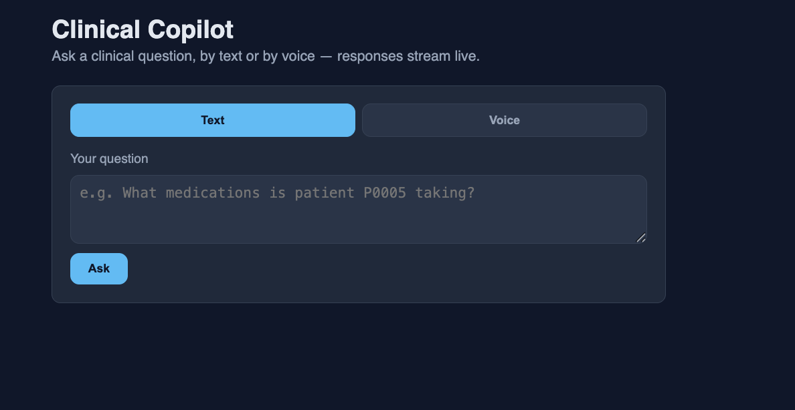 |

| Voice Interaction | Real-Time Streaming |
|:---:|:---:|
| 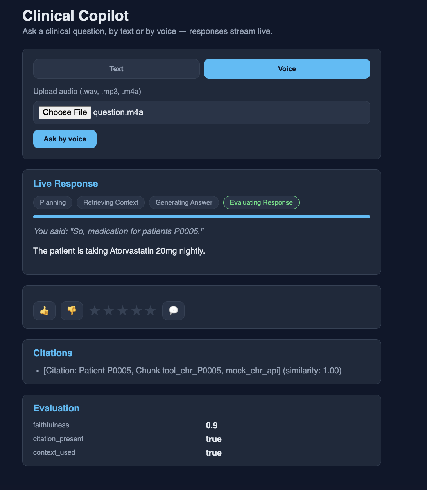 | 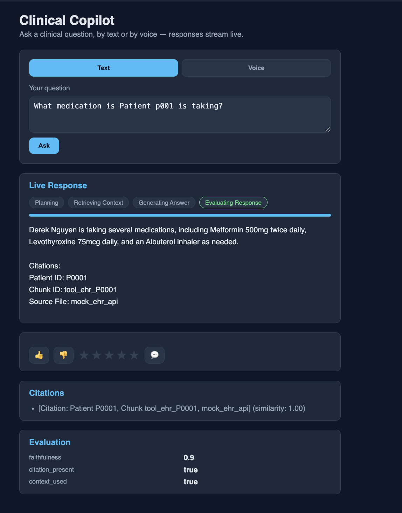 |

| Feedback  | Admin Analytics |
|:---:|:---:|
| 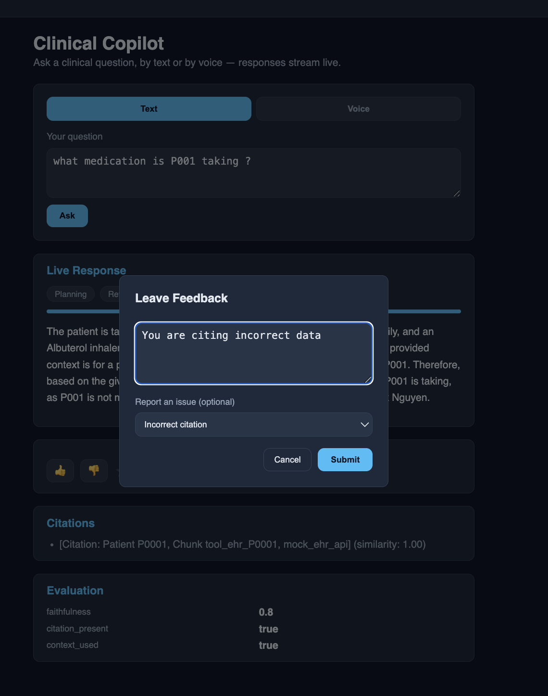 | 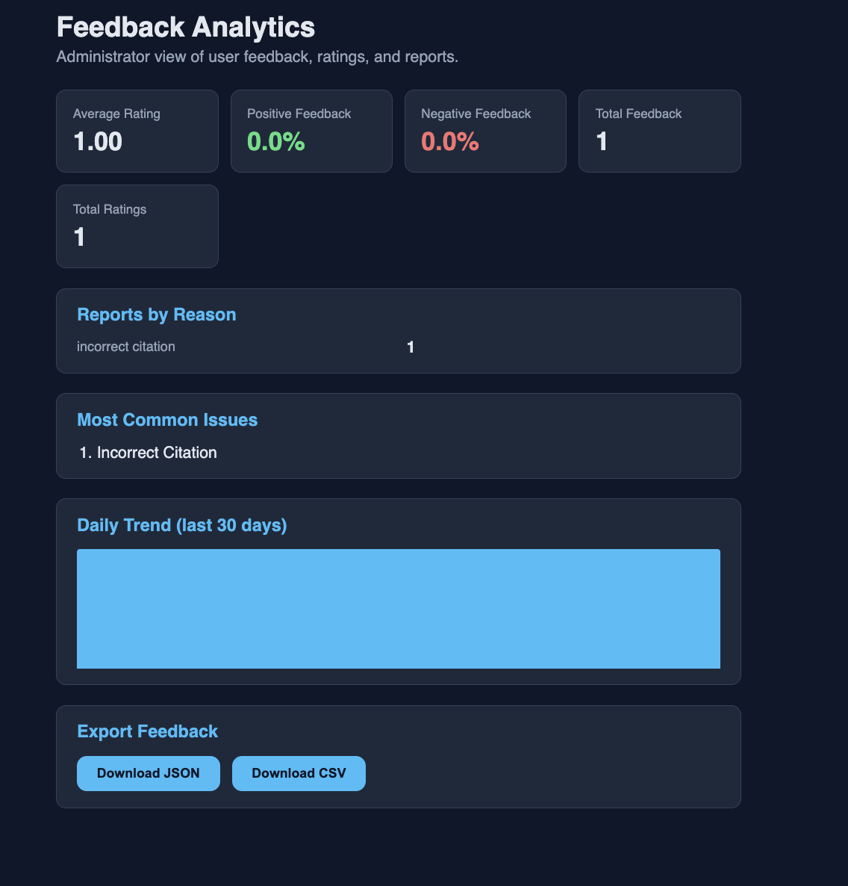 |

*Screenshots pending capture from a running deployment — see [Installation](#-installation) to run it yourself.*

</div>

---

## ✨ Features

<details open>
<summary><strong>🤖 AI & Agentic Reasoning</strong></summary>

- LangGraph agent graph: Planner → Tool Router → Retriever/Tool → Generator → Evaluator
- Retrieval-Augmented Generation over ChromaDB with section-aware chunking
- Rule-based tool router with mock EHR, Clinical Notes, and Wearables tools
- LLM-as-a-judge faithfulness scoring on every generated answer
- Automatic citation generation and inline source attribution
- Token-level streaming generation via Groq's streaming chat API

</details>

<details open>
<summary><strong>🛠️ Backend</strong></summary>

- FastAPI with async SQLAlchemy 2.x ORM and Alembic migrations
- Clean layered architecture: routes → services → domain logic → persistence
- Dependency-injected, fully testable service layer
- Async PostgreSQL via `asyncpg`, persistent ChromaDB vector store

</details>

<details open>
<summary><strong>🎨 Frontend</strong></summary>

- Vanilla HTML/CSS/JS single-page app (no framework overhead)
- Live token streaming with typing-cursor animation
- Real-time LangGraph node status, progress bar, and citation panel
- Dedicated admin analytics dashboard

</details>

<details open>
<summary><strong>🔐 Authentication</strong></summary>

- JWT access + refresh token flow
- Google OAuth via Google Identity Services
- Bcrypt password hashing
- Query-param token auth for SSE/WebSocket transports that can't set headers

</details>

<details open>
<summary><strong>📊 Observability</strong></summary>

- Structured JSON logging via `structlog` with request/correlation ID propagation
- OpenTelemetry tracing (FastAPI + SQLAlchemy auto-instrumented)
- Prometheus metrics (`/metrics`) — latency, tokens, errors, per-node duration
- Optional LangSmith tracing for LangGraph/LLM calls
- Composite `/health` and `/health/detailed` dependency health checks

</details>

<details open>
<summary><strong>🛡️ Security</strong></summary>

- Per-user + IP-fallback rate limiting (`slowapi`)
- Daily request / monthly token / monthly cost quotas
- Security headers (CSP, HSTS, X-Frame-Options, etc.)
- Request size limiting, trusted host enforcement, CORS hardening
- Non-root Docker containers, image scanning, dependency auditing

</details>

<details open>
<summary><strong>🚀 Deployment</strong></summary>

- Multi-stage, non-root Docker images for backend, worker, beat, and Nginx
- Docker Compose for both development and production topologies
- Nginx reverse proxy with gzip, SSE/WebSocket-aware buffering, and rate limiting
- GitHub Actions: CI, security scanning, CD (build & push to GHCR), tagged releases

</details>

<details open>
<summary><strong>🧪 Testing</strong></summary>

- 200+ unit and integration tests across every module
- In-memory SQLite fixtures for fast, infra-free test runs
- End-to-end and smoke test suites
- Deployment-artifact validation tests (Dockerfiles, Compose files)

</details>

</details>

---

## 🧰 Tech Stack

### Backend

| Technology | Purpose |
|---|---|
| **Python 3.12** | Core language |
| **FastAPI** | Async REST/SSE/WebSocket API framework |
| **SQLAlchemy 2.x (async)** | ORM over PostgreSQL |
| **Alembic** | Database schema migrations |
| **Pydantic / pydantic-settings** | Validation & typed configuration |
| **python-jose / passlib** | JWT signing & password hashing |

### AI / ML

| Technology | Purpose |
|---|---|
| **LangGraph** | Agent orchestration graph |
| **LangChain** | LLM/prompt abstractions |
| **Groq (Llama 3.x)** | Chat completion + streaming generation |
| **Groq Whisper** | Speech-to-text transcription |
| **FastEmbed (BAAI/bge-small-en-v1.5)** | Text embeddings |
| **ChromaDB** | Persistent vector store |

### Database & Storage

| Technology | Purpose |
|---|---|
| **PostgreSQL 16** | Primary relational store (users, conversations, feedback, usage) |
| **ChromaDB** | Vector store for clinical note embeddings |
| **Redis** | Celery broker/result backend |

### Frontend

| Technology | Purpose |
|---|---|
| **HTML5 / CSS3** | Structure & styling |
| **Vanilla JavaScript (ES Modules)** | No-framework SPA logic |
| **EventSource / Fetch Streams / WebSocket** | Real-time transports |

### Infrastructure & DevOps

| Technology | Purpose |
|---|---|
| **Docker / Docker Compose** | Containerization & orchestration |
| **Nginx** | Reverse proxy, TLS termination point, static hosting |
| **Celery + Celery Beat** | Background & scheduled tasks |
| **GitHub Actions** | CI, security scanning, CD, releases |
| **uv** | Python dependency & environment management |

### Observability

| Technology | Purpose |
|---|---|
| **structlog** | Structured JSON logging |
| **OpenTelemetry** | Distributed tracing |
| **Prometheus client** | Metrics exposition |
| **LangSmith** *(optional)* | LLM/agent trace visualization |

### Testing

| Technology | Purpose |
|---|---|
| **pytest / pytest-asyncio** | Test framework |
| **aiosqlite** | In-memory async DB fixtures |
| **httpx / FastAPI TestClient** | API testing |
| **ruff / mypy / bandit / pip-audit** | Lint, types, security static analysis |

---

## 🏗️ System Architecture

### Overall Architecture

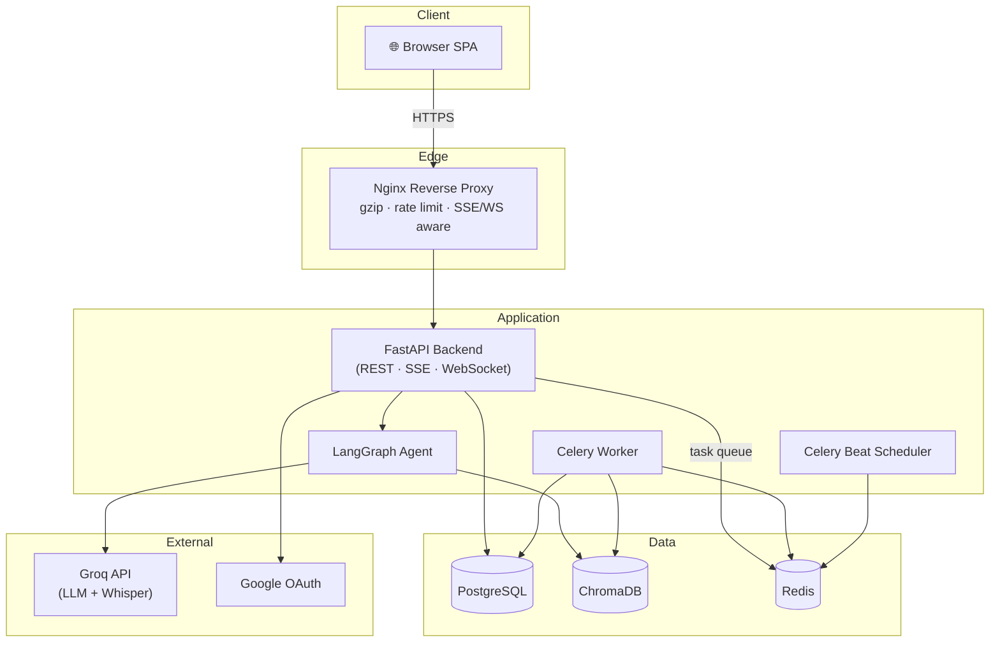

### RAG Pipeline

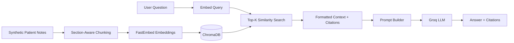

### LangGraph Workflow

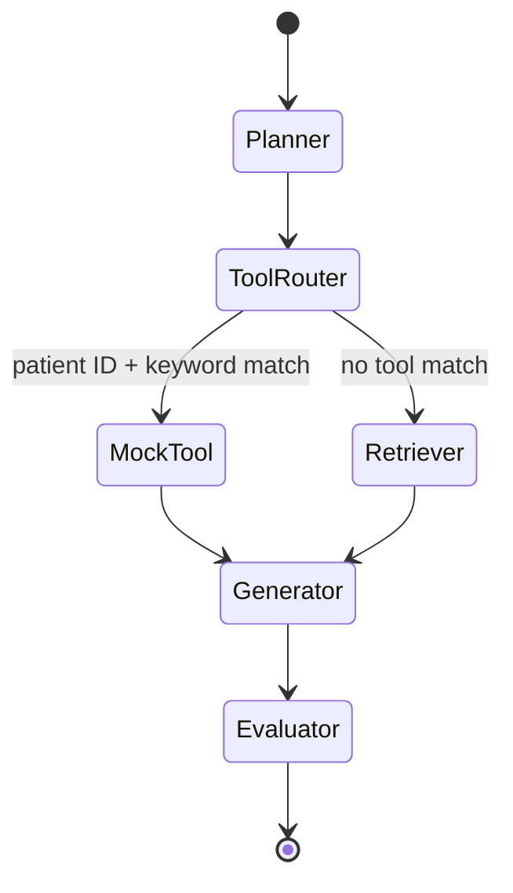

### Deployment Architecture

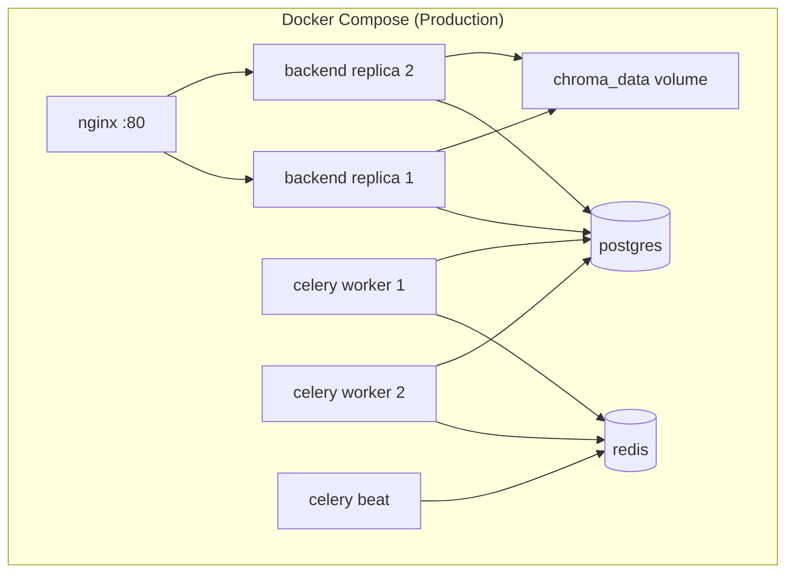

---

## 📁 Project Structure

```
clinical-copilot/
├── app/                    # FastAPI app: main.py, config, core routes, schemas, services
├── ingest/                 # Synthetic patient generation, chunking, embeddings
├── rag/                    # Retrieval layer: models, retriever, search, formatter
├── llm/                    # Groq client, prompt templates, citations, generation
├── evaluation/             # QA dataset generation, metrics, LLM-as-judge, reporting
├── agent/                  # LangGraph state, nodes, graph construction
├── tools/                  # Mock EHR / Notes / Wearables tools + rule-based router
├── voice/                  # Audio validation, Whisper transcription, memory, pipeline
├── database/               # SQLAlchemy models, CRUD, session, dependencies
├── auth/                   # JWT, OAuth, password hashing, auth service
├── security/               # Rate limiting, quotas, budget tracking, headers, validators
├── observability/          # Logging, tracing, metrics, health checks, LangSmith
├── feedback/                # Feedback/rating/report models, analytics, export
├── streaming/               # SSE/WebSocket transports, event schemas, progress
├── worker/                  # Celery app, background task definitions
├── frontend/                # Vanilla JS SPA (chat, voice, streaming, feedback, admin)
├── deployment/
│   ├── docker/               # Backend / worker / beat Dockerfiles
│   ├── nginx/                # Nginx config + Dockerfile
│   ├── scripts/               # backup / restore / migrate / deploy / healthcheck
│   └── compose/                # docker-compose.yml (dev) & .prod.yml
├── .github/workflows/       # ci.yml, cd.yml, security.yml, release.yml
├── alembic/                  # Database migrations
├── scripts/                   # CLI utilities (ingest, evaluate, seed, export, reports)
├── tests/                     # Unit, integration, e2e, smoke, deployment tests
├── docs/                       # Deployment, architecture, API, security, troubleshooting
├── Makefile
└── pyproject.toml
```

---

## ⚙️ Installation

### 1. Clone the repository

```bash
git clone https://github.com/manozpdel/Clinical-Copilot.git
cd clinical-copilot
```

### 2. Install dependencies with `uv`

```bash
uv sync --all-extras --dev
```

### 3. Configure environment

```bash
cp .env.example .env
# edit .env with your Groq API key(s), JWT secret, and Google OAuth credentials
```

### 4. Start PostgreSQL, Redis, and ChromaDB

ChromaDB is embedded (persisted to `./chroma_db`) — no separate service needed locally. For Postgres and Redis, either run them via Docker:

```bash
docker compose -f deployment/compose/docker-compose.yml up -d postgres redis
```

or point `DATABASE_URL` / `REDIS_URL` at existing instances.

### 5. Initialize the database

```bash
uv run python scripts/create_db.py
# or, for versioned migrations:
uv run alembic upgrade head
```

### 6. Generate & ingest synthetic patient data

```bash
uv run python scripts/ingest_data.py
```

### 7. Run the application

```bash
uv run uvicorn app.main:app --reload
```

Visit **http://localhost:8000/app/** for the frontend, and **http://localhost:8000/docs** for interactive API docs.

---

## 🔑 Environment Variables

<details>
<summary><strong>Click to expand full environment variable reference</strong></summary>

| Variable | Description | Default |
|---|---|---|
| `APP_NAME` | Application display name | `Clinical Copilot API` |
| `ENVIRONMENT` | Deployment environment | `development` |
| `DEBUG` | Enable debug mode | `false` |
| `LOG_LEVEL` | Logging verbosity | `INFO` |
| `HOST` / `PORT` | Bind address | `0.0.0.0` / `8000` |
| `GENERATION_API_KEY` / `GENERATION_MODEL` | Groq key/model for answer generation | — |
| `FAITHFULNESS_API_KEY` / `FAITHFULNESS_MODEL` | Groq key/model for faithfulness judging | — |
| `RELEVANCE_API_KEY` / `RELEVANCE_MODEL` | Groq key/model for relevance judging | — |
| `TRANSCRIPTION_API_KEY` / `GROQ_WHISPER_MODEL` | Groq key/model for voice transcription | `whisper-large-v3` |
| `LLM_REQUESTS_PER_MINUTE` | Client-side LLM rate throttle | `20` |
| `TOP_K` | Retrieval chunks per query | `8` |
| `CHUNK_SIZE` / `CHUNK_OVERLAP` | Ingestion chunking parameters | `120` / `20` |
| `DATABASE_URL` | Async PostgreSQL connection string | — |
| `JWT_SECRET_KEY` / `JWT_ALGORITHM` | JWT signing config | — / `HS256` |
| `ACCESS_TOKEN_EXPIRE_MINUTES` / `REFRESH_TOKEN_EXPIRE_DAYS` | Token lifetimes | `30` / `7` |
| `GOOGLE_CLIENT_ID` / `GOOGLE_CLIENT_SECRET` | Google OAuth credentials | — |
| `ENABLE_RATE_LIMITING` / `RATE_LIMIT_PER_MINUTE` / `RATE_LIMIT_PER_HOUR` | Rate limiting config | `true` / `30` / `300` |
| `DAILY_REQUEST_LIMIT` / `MONTHLY_TOKEN_LIMIT` / `MONTHLY_COST_LIMIT` | Per-user quotas | `200` / `2000000` / `50.0` |
| `TRUSTED_HOSTS` / `CSP_POLICY` | Security headers config | `["*"]` / `default-src 'self'` |
| `ENABLE_TRACING` / `OTEL_EXPORTER_OTLP_ENDPOINT` | OpenTelemetry config | `false` / — |
| `ENABLE_LANGSMITH` / `LANGSMITH_API_KEY` / `LANGSMITH_PROJECT` | LangSmith tracing config | `false` / — / `clinical-copilot` |
| `PROMETHEUS_ENABLED` | Expose `/metrics` | `true` |
| `ENABLE_FEEDBACK` / `ENABLE_EXPORT` / `ENABLE_HALLUCINATION_REPORTS` | Feedback system toggles | `true` / `true` / `true` |
| `ADMIN_EMAILS` | Emails granted analytics/export access | `[]` |
| `ENABLE_STREAMING` / `ENABLE_WEBSOCKETS` | Streaming toggles | `true` / `true` |
| `STREAM_HEARTBEAT_INTERVAL` / `MAX_STREAM_DURATION` | Streaming tuning | `15.0` / `120.0` |
| `REDIS_URL` | Redis connection string | `redis://localhost:6379/0` |
| `CELERY_BROKER_URL` / `CELERY_RESULT_BACKEND` | Celery Redis DBs | `redis://localhost:6379/1` / `/2` |
| `CELERY_TASK_TIME_LIMIT` / `CELERY_TASK_MAX_RETRIES` | Task execution limits | `300` / `3` |
| `MAX_UPLOAD_SIZE` / `MAX_REQUEST_SIZE_MB` | Upload/body size limits | `10000000` / `10.0` |
| `IS_PRODUCTION` / `WORKERS` | Production runtime config | `false` / `4` |

*Full reference with inline docstrings: `app/core/config.py`.*

</details>

---

## ▶️ Running the Project

### Development

```bash
make dev
```

Starts PostgreSQL, Redis, backend, Celery worker, and Celery beat via Docker Compose, with the frontend served at `/app`.

### Production

```bash
cp deployment/compose/.env.production.example .env.production
# edit with production secrets
make prod
```

Builds and runs the full production topology — Nginx, 2× backend replicas, 2× Celery workers, Celery beat, PostgreSQL, and Redis.

### Manual (no Docker)

```bash
uv run uvicorn app.main:app --reload          # API + frontend
uv run celery -A worker.celery_app worker     # background tasks
uv run celery -A worker.celery_app beat       # scheduler
```

---

## 📡 API Documentation

Interactive docs are always available at **`/docs`** (Swagger) and **`/redoc`**. Highlights:

| Category | Endpoint | Description |
|---|---|---|
| **System** | `GET /health` | Liveness check |
| | `GET /health/detailed` | Full dependency health (auth required) |
| | `GET /api/version` | Version & environment info |
| | `GET /metrics` | Prometheus metrics |
| **Auth** | `POST /auth/register` `/auth/login` `/auth/refresh` | Local credential auth |
| | `POST /login/google` | Google OAuth login |
| | `GET /auth/me` | Current user profile |
| **Query** | `POST /api/query` | Blocking text Q&A via the agent |
| | `POST /api/voice` | Blocking voice Q&A (upload audio) |
| **Streaming** | `GET /stream/query` | SSE streamed text Q&A |
| | `POST /stream/voice` | SSE streamed voice Q&A |
| | `GET /ws` | Bidirectional WebSocket Q&A |
| **Feedback** | `POST /feedback` `PUT/DELETE /feedback/{id}` | Like/dislike + comments |
| | `POST /feedback/rating` | 1–5 star ratings |
| | `POST /feedback/report` | Hallucination/quality reports |
| | `GET /feedback/history` `/feedback/compare` | Personal history & comparison |
| | `GET /feedback/analytics` `/feedback/export` | Admin-only analytics & export |

---

## 🧠 AI Pipeline

```
Synthetic Patient Notes
        │
        ▼
 Section-Aware Chunking  ──▶  FastEmbed Embeddings  ──▶  ChromaDB (persisted)
        │
        ▼
 User Question ──▶ Embed Query ──▶ Top-K Retrieval ──▶ Context + Citations
        │
        ▼
 Prompt Builder (system + context + question)
        │
        ▼
 Groq LLM (streaming or blocking generation)
        │
        ▼
 Citation Formatter ──▶ Faithfulness Evaluation (LLM-as-judge)
        │
        ▼
 Final Answer + Citations + Evaluation Scores
```

Every stage is a pure, independently testable function — the same retrieval/generation/evaluation code powers the blocking REST endpoints, the SSE stream, the WebSocket handler, and the offline evaluation harness (`scripts/evaluate.py`).

---

## 🔐 Authentication Flow

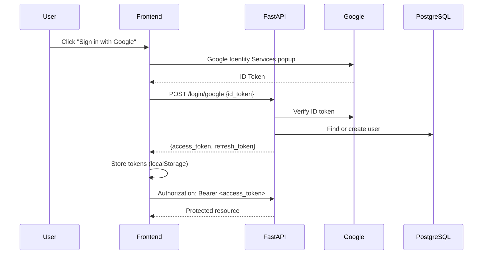

- **Access tokens** are short-lived (30 min default); **refresh tokens** are longer-lived (7 days default)
- SSE (`EventSource`) and WebSocket connections authenticate via a `?token=` query parameter, since neither transport can set custom headers
- Passwords are hashed with **bcrypt**; OAuth-only accounts have no local password

---

## 🗄️ Database Schema

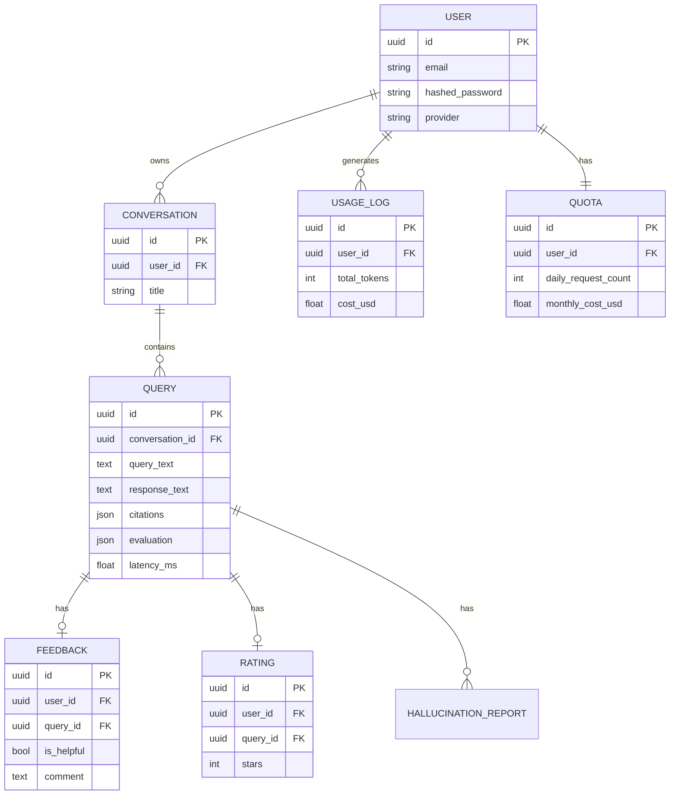

Schema managed via **Alembic** migrations (`alembic/versions/`); every table uses a portable `GUID` type that maps to native `UUID` on PostgreSQL and `CHAR(36)` on SQLite for fast, infra-free testing.

---

## 🔍 RAG Pipeline

1. **Ingestion** — 20 synthetic patients with realistic demographics, history, medications, allergies, vitals, and notes are generated and written to disk
2. **Chunking** — notes are split **section-aware** (Chief Complaint, Medications, Allergies, etc.) so retrieval never returns a partial section, and every chunk has the patient ID prepended so identity travels with content
3. **Embedding** — `BAAI/bge-small-en-v1.5` via FastEmbed
4. **Storage** — persisted to a local ChromaDB collection
5. **Retrieval** — query is embedded, top-K nearest chunks are fetched, filtered by minimum similarity
6. **Citation** — every chunk's Patient ID / Chunk ID / Source File is preserved end-to-end into the final answer

---

## 🕸️ LangGraph Workflow

| Node | Responsibility |
|---|---|
| **Planner** | Validates & normalizes the question, assigns conversation/request IDs |
| **Tool Router** | Extracts patient ID + keywords; routes to a mock clinical tool or falls back to retrieval |
| **Retriever** | Semantic search over ChromaDB when no tool applies |
| **Generator** | Builds the prompt and generates the answer (Groq, streaming-capable) |
| **Evaluator** | Scores faithfulness via LLM-as-judge; checks citation presence & context usage |

The graph is intentionally linear with one conditional branch (tool vs. retrieval), designed to be extended with additional tools or branching without restructuring existing nodes.

---

## 🎙️ Voice Pipeline

```
Audio Upload (.wav/.mp3/.m4a)
        │
        ▼
 Format & Signature Validation
        │
        ▼
 Groq Whisper (whisper-large-v3) Transcription
        │
        ▼
 Conversation Memory (per-session, in-memory)
        │
        ▼
 LangGraph Agent (same pipeline as text queries)
        │
        ▼
 Transcript + Answer + Citations + Evaluation
```

The transcriber is built behind an abstract `Transcriber` interface, so the Whisper provider can be swapped without touching the pipeline. Retries use exponential backoff with jitter, matching the pattern used for LLM calls.

---

## ⚡ Streaming

Two real-time transports, both reusing the exact same pipeline logic as the blocking endpoints:

- **Server-Sent Events** (`GET /stream/query`, `POST /stream/voice`) — one-directional, auto-reconnecting friendly, heartbeats sent during LLM/evaluation gaps
- **WebSocket** (`GET /ws`) — bidirectional, supports multiple question/answer turns over one connection

Event types: `token`, `node_start`, `node_complete`, `tool_start`, `tool_complete`, `citation`, `evaluation`, `progress`, `heartbeat`, `finished`, `error`. The frontend renders tokens with a typing-cursor animation and live node/progress indicators as they arrive.

---

## 📈 Observability

| Pillar | Implementation |
|---|---|
| **Structured Logging** | `structlog` JSON logs with request/correlation/user/conversation IDs auto-bound per request |
| **Tracing** | OpenTelemetry, FastAPI + SQLAlchemy auto-instrumented, manual spans around agent nodes, LLM calls, retrieval, tools, and transcription |
| **Metrics** | Prometheus (`/metrics`): request count/latency/errors, LLM latency/tokens, retriever/database/tool/voice latency, per-node duration |
| **LangSmith** | Optional, toggled via `ENABLE_LANGSMITH` — traces the full LangGraph + LLM execution |
| **Health** | `/health` liveness + `/health/detailed` (DB, ChromaDB, Groq config, LangSmith, disk, memory) |

---

## 👍 Human Feedback System

- 👍 / 👎 thumbs feedback + optional written comments (upsert per user/response)
- ⭐ 1–5 star ratings, resubmittable
- 🚩 Structured issue reporting: hallucination, incorrect citation, unsafe response, incomplete answer
- 📜 Personal conversation history with attached feedback/ratings
- 🔄 Side-by-side response comparison
- 📊 Admin-only analytics dashboard: average rating, positive/negative %, issue breakdown, 30-day trend
- 📤 CSV/JSON export of all feedback for offline analysis

---

## 🧪 Experiment Framework

Clinical Copilot includes a built-in offline evaluation framework for benchmarking Retrieval-Augmented Generation (RAG) quality. The framework provides reproducible evaluation of retrieval and generation performance using standard metrics.

### Latest Benchmark Results

| Metric | Value |
|--------|------:|
| Questions Evaluated | **10** |
| Recall@K | **1.00** |
| Mean Reciprocal Rank (MRR) | **0.92** |
| Faithfulness | **0.80** |
| Answer Relevance | **0.88** |
| Average Latency | **1.29 s/query** |

### Run the Evaluation

```bash
uv run python scripts/evaluate.py
```

The evaluation framework measures:

- Recall@K
- Mean Reciprocal Rank (MRR)
- Faithfulness
- Answer Relevance
- Average Response Latency

The evaluation pipeline is located in `evaluation/` and `scripts/evaluate.py`, making it easy to reproduce results, benchmark future model improvements, and compare retrieval and generation quality across different system configurations.

---

## ⏱️ Background Jobs

| Component | Role |
|---|---|
| **Redis** | Celery broker (DB 1) + result backend (DB 2) |
| **Celery Worker** | Executes evaluation re-runs, embedding regeneration, analytics recomputation, quota resets |
| **Celery Beat** | Schedules periodic cleanup, analytics refresh, and quota-reset safety net |

All tasks are thin wrappers around existing pure functions from the evaluation, ingestion, and feedback modules — no business logic is duplicated in the task layer.

---

## 🔁 CI/CD

| Workflow | Trigger | Purpose |
|---|---|---|
| `ci.yml` | Push / PR | Lint (ruff), type check (mypy), tests (pytest), Docker image builds |
| `security.yml` | Push / PR / weekly | Dependency audit (pip-audit), static analysis (bandit), image scanning (Trivy) |
| `cd.yml` | Push to `main` | Build & push tagged images to GHCR, run smoke tests |
| `release.yml` | Version tag (`v*.*.*`) | Auto-generate GitHub Release notes from `CHANGELOG.md` |

---

## ✅ Testing

```bash
uv run pytest -m "not slow"          # full fast suite (200+ tests, no live infra)
uv run pytest tests/test_e2e.py      # end-to-end integration flows
uv run pytest tests/test_smoke.py    # smoke tests
uv run pytest tests/test_deployment.py  # Dockerfile/Compose artifact validation
```

- **Unit tests** — every pure function (chunking, retrieval, citation formatting, budget estimation, JWT, validators) tested in isolation
- **Integration tests** — full API round-trips using dependency-injected fakes and in-memory SQLite, no live Postgres/Groq/Redis required
- **End-to-end tests** — auth → query → feedback → history flows exercised together
- **Deployment tests** — Dockerfiles parse correctly, run as non-root, Compose files reference valid services

---

## 📊 Performance

| Metric | Value |
|---|---|
| Avg. text query latency (Groq `llama-3.3-70b-versatile`) | *benchmark pending* |
| Avg. retrieval latency (ChromaDB, 20-patient corpus) | *benchmark pending* |
| Avg. voice transcription latency (Whisper large-v3) | *benchmark pending* |
| SSE time-to-first-token | *benchmark pending* |
| P95 API latency under load | *benchmark pending* |

*Run `uv run python scripts/usage_report.py` and `/metrics` against your own deployment to populate real numbers.*

---

## 🛡️ Security

- **OAuth 2.0** — Google Identity Services, ID token verification against Google's `tokeninfo` endpoint
- **JWT** — signed access/refresh tokens, bcrypt-hashed local passwords
- **Rate Limiting** — per-user (JWT-derived) with IP fallback, dual-layer with Nginx `limit_req`
- **Quotas** — daily request, monthly token, and monthly cost ceilings per user
- **Validation** — strict Pydantic schemas, content-type/size checks, control-character sanitization
- **Headers** — CSP, HSTS, X-Frame-Options, X-Content-Type-Options, Referrer-Policy on every response
- **Containers** — all images run as non-root UID 1000; scanned with Trivy in CI
- **Secrets** — never committed; all read from environment variables

---

## 🚢 Deployment

```bash
# Development
make dev

# Production
cp deployment/compose/.env.production.example .env.production
make prod

# Backup / Restore
make backup
bash deployment/scripts/restore.sh backups/postgres_<timestamp>.dump
```

Production topology: **Nginx** (reverse proxy + static frontend) → 2× **FastAPI backend** replicas → **PostgreSQL** + **Redis** + persistent **ChromaDB** volume, with 2× **Celery worker** replicas and one **Celery beat** scheduler. Full guide: [`docs/DEPLOYMENT.md`](docs/DEPLOYMENT.md).

---

## 🗺️ Roadmap

- [x] **Part 1** — FastAPI project bootstrap
- [x] **Part 2** — Synthetic data ingestion & embedding pipeline
- [x] **Part 3** — Semantic retrieval layer (RAG)
- [x] **Part 4** — LLM answer generation & evaluation harness
- [x] **Part 5** — LangGraph agent orchestration
- [x] **Part 6** — Mock clinical tools & rule-based routing
- [x] **Part 7** — Voice pipeline & conversation memory
- [x] **Part 8** — FastAPI REST API & frontend
- [x] **Part 9** — PostgreSQL persistence, JWT & Google OAuth
- [x] **Part 10** — Rate limiting, quotas & security hardening
- [x] **Part 11** — Observability (logging, tracing, metrics, LangSmith)
- [x] **Part 12** — Human feedback system & admin analytics
- [x] **Part 13** — Real-time streaming (SSE & WebSocket)
- [x] **Part 15** — Production deployment, CI/CD & documentation
- [ ] **Future** — Dedicated experiment/benchmarking framework
- [ ] **Future** — Multi-tenant clinic support
- [ ] **Future** — Real EHR/FHIR integration adapters

---

## 🤝 Contributing

Contributions are welcome! Please read [`docs/CONTRIBUTING.md`](docs/CONTRIBUTING.md) for the full guide.

```bash
uv sync --all-extras --dev
cp .env.example .env
uv run python scripts/create_db.py
uv run python scripts/ingest_data.py

make lint
make format
make test
```

- Follow [Conventional Commits](https://www.conventionalcommits.org/) (`feat:`, `fix:`, `docs:`, `test:`, `chore:`)
- Business logic belongs in a `service.py`, never in a route handler
- Never duplicate logic that already exists in an earlier module — import and reuse it
- Branch naming: `feature/<short-description>`

---

## ❓ FAQ

<details>
<summary><strong>Is this using real patient data?</strong></summary>

No. All patient records are synthetically generated for demonstration purposes (`ingest/generator.py`, `tools/mock_data.py`). No real PHI is used anywhere in this project.

</details>

<details>
<summary><strong>Which LLM provider does it use?</strong></summary>

Groq, using Llama 3.x models (`llama-3.3-70b-versatile` for generation, `llama-3.1-8b-instant` for faster judging tasks by default). The client is abstracted so other OpenAI-compatible providers (e.g. OpenRouter) can be swapped in.

</details>

<details>
<summary><strong>Can I run it without Docker?</strong></summary>

Yes — see [Installation](#-installation). Docker is required only for the full production topology (Nginx, multi-replica backend, Celery workers).

</details>

<details>
<summary><strong>Why FastEmbed instead of OpenAI embeddings?</strong></summary>

FastEmbed runs `BAAI/bge-small-en-v1.5` locally with no external API dependency or per-call cost, keeping the retrieval layer fast and free to run repeatedly during development and evaluation.

</details>

<details>
<summary><strong>How is answer faithfulness measured?</strong></summary>

Via LLM-as-a-judge: a separate Groq call scores whether every claim in the generated answer is supported by the retrieved context, returning a 0.0–1.0 faithfulness score stored alongside the response.

</details>

<details>
<summary><strong>Is there rate limiting to prevent abuse?</strong></summary>

Yes — per-user (JWT-derived) and IP-fallback rate limiting via `slowapi`, plus daily request / monthly token / monthly cost quotas enforced before every agent call, in addition to Nginx-level `limit_req` in production.

</details>

---

## 📄 License

Distributed under the **MIT License**. See [`LICENSE`](LICENSE) for full text.

---

## 🙏 Acknowledgements

This project builds on the excellent work of the open-source and AI infrastructure community:

- [FastAPI](https://fastapi.tiangolo.com/) — the async Python web framework at the core of this project
- [LangGraph](https://langchain-ai.github.io/langgraph/) — agent orchestration
- [Groq](https://groq.com/) — blazing-fast LLM and Whisper inference
- [ChromaDB](https://www.trychroma.com/) — the vector store powering retrieval
- [OpenTelemetry](https://opentelemetry.io/) — vendor-neutral observability standard
- [PostgreSQL](https://www.postgresql.org/) — the world's most advanced open-source database
- [Redis](https://redis.io/) — Celery's broker and the project's caching layer

---

## 📬 Contact

**Project Maintainer**

[](https://github.com/manozpdel)
[](https://www.linkedin.com/in/manozpdel/)
[](mailto:manojpdel2057@gmail.com)

---

<div align="center">

**⭐ If you find this project useful, consider giving it a star! ⭐**

*Built as a comprehensive demonstration of production AI engineering practices.*

</div>